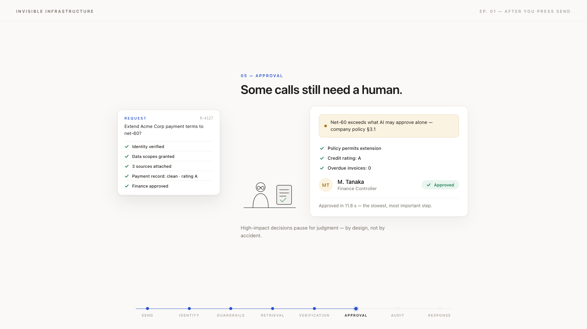

# Invisible Infrastructure · Episode 01

## What actually happens after you press Send?

[Launch the interactive demo](https://ihatovremains.github.io/invisible-infrastructure-01/) · [View the source](https://github.com/ihatovremains/invisible-infrastructure-01)

[](https://ihatovremains.github.io/invisible-infrastructure-01/)

A customer is ready to sign—but asks for net-60 payment terms.

The interesting question is not whether an AI can draft a reply. It is whether the surrounding system can establish who is asking, what it may read, which facts are missing, when a human must decide, and how the result can be audited.

I created this interactive motion piece to turn that invisible enterprise workflow into a story a non-specialist can follow in under a minute. One persistent request packet travels through seven checkpoints and visibly accumulates identity, permissions, evidence, verification, approval, and an audit trace.

**Role:** Concept, information architecture, UX/UI, motion design, front-end implementation, deterministic video rendering, and QA.

## The design challenge

Enterprise AI diagrams often become technically accurate but difficult to understand—or visually simple but misleading. The goal was to preserve the accountability model while making the experience readable without specialist knowledge.

Business meaning stays in the foreground. Technical detail remains available as secondary notation.

## One request, seven checkpoints

| Checkpoint | Question made visible | What the request gains |
|---|---|---|
| Identity | Who is asking? | Verified identity and data scopes |
| Guardrails | Is this safe to answer? | A human-approval requirement |
| Retrieval | What does the company know? | Three cited sources |
| Verification | What is still missing? | A verified finance record |
| Approval | Who has authority to decide? | Finance approval |
| Audit | Can the decision be replayed? | An immutable trace |
| Response | What can safely return to the user? | A grounded, approved answer |

## Key design decisions

- **One persistent mental model.** The request packet remains visible across the journey instead of becoming seven disconnected screens.
- **Progressive disclosure.** Plain business language carries the story; implementation details sit in quiet technical footnotes.
- **Human authority as a state change.** Approval is not merely described—the amber risk flag moves beneath its evidence and becomes a verified approval.
- **Deterministic scene state.** Packet state is reconstructed from the scene index, so replaying and stepping through the experience remains consistent.
- **Two presentation modes.** The same source supports an interactive desktop experience and a 1080×1350 social-video composition.

## Build and quality

| Layer | Implementation |
|---|---|
| Interactive experience | One dependency-free `index.html` using HTML, CSS, JavaScript, and inline SVG |
| Motion system | Nine horizontally arranged scenes, a lightweight timeline engine, and CSS transforms |
| Video rendering | Playwright and Chromium driven by a controlled virtual timeline at 30 fps |
| Image pipeline | 1,572 lossless frames rendered at 2160×2700 and downsampled with Lanczos |
| Delivery | 52.4-second H.264 High master at 1080×1350 |
| QA | Clean opening, continuous camera motion, hidden capture UI, exact credit, and a 2.5-second completed closing hold |

## Run locally

Open `index.html` directly, or serve the directory:

```bash
python3 -m http.server 8000
```

Then visit `http://localhost:8000`.

Controls: `R` replay · `Space` pause/play · `←` `→` move between scenes · `S` social mode.

<details>
<summary>Deterministic video workflow</summary>

Requires Node.js, Playwright, Chromium, FFmpeg, and ffprobe. Video verification additionally uses Python, OpenCV, NumPy, and Pillow.

```bash
npm install
./render-video.sh --smoke --clean
./render-video.sh --clean
python3 -m pip install -r requirements-qa.txt
python3 verify-video.py
```

</details>

## About the scenario

All people, organizations, contracts, policies, endpoints, identifiers, and timing values shown here are fictional. Product names are used only as illustrative examples.

This is a conceptual visualization—not a reference architecture, compliance claim, or recording of a production system.

## License

Released under the [MIT License](LICENSE).

© 2026 Takaaki Suzuki
